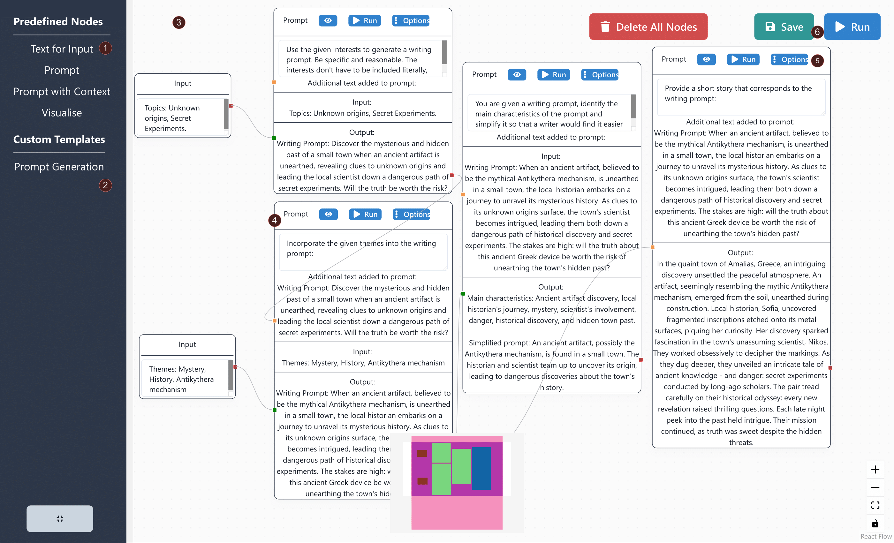
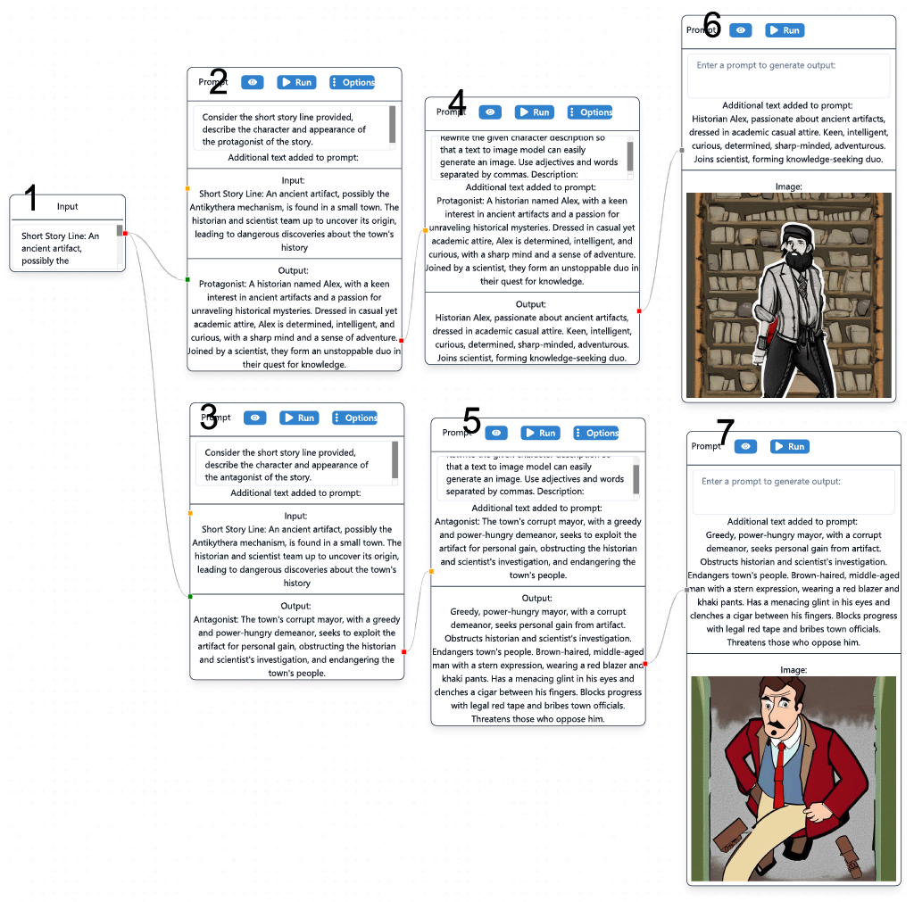

# CustomPrompChainsUI
A Graphical Node-based interface for LLMs used to explore ideation and creativity for writers.

Users chain together generative AI models organised into nodes for creative tasks. This system was designed to overcome the structural constraints inherent in traditional chat-based, one-on-one interactions. These limitations include 
1) a linear nature of conversation which hinders exploration and ideation for potentially complex creative tasks and
2) the dependence of each subsequent interaction on all previous interactions in a linear conversation. This makes it difficult to share conversation templates for specific tasks because the templates lose their context and flexibility when applied to new conversations.
The system can be used for co-creative writing, as demonstrated through the example templates where each template corresponds to a possible use case.

## The User Interface

*System User Interface (Demonstrates writing prompt generation template)- (1) The 4 Predefined Node options. (2) Custom Node section where templates can be dropped in to make them available in the user interface. (3) The workspace, nodes from the sidebar can be dragged and dropped into the workspace and subsequently edited. (4) A node, in this case, a Prompt with Context, the handles on the left side of each node can be connected to outputs from other nodes. (5) The node header contains buttons that activate additional functionality - like running individual nodes, viewing node information in a user-friendly Modal, and changing node-specific parameters like temperature for generation. (6) The save button downloads the current workspace as a template in the form of a JSON file, and the run button runs all nodes in topological order.*

## An example
The following template provides an example where the system can be used by creative writers to explore, generate and visualise characters for their stories.

*A demonstration of the Character Visualisation and Exploration use case. (1) contains a short storyline. (2) and (3) use the short storyline to create a protagonist and antagonist character description. (4) and (5) are used to prepare the descriptions for visualisation by converting them into a form that is more friendly for text-to-image prompting. (6) and (7) display visualisations for the characters.*

## Repository Organisation
The repository is divided into a React.js [frontend](./frontend) and a Flask [backend](./backend). Both can be set up by following the instructions in the README.md(s) of the respective folders. The .env file can be used to set the location of the backend where api calls are made to get output from LLMs. The front end uses ReactFlow to provide node-based functionality. Zustand is used for state management. Material UI is used for the styling of different components.

The backend uses Mistral-7B and Stable Diffusion 2.1 via the transformers and diffusers libraries respectively. We run the backend models on a NVIDIA RTX A6000 50GB GPU.

## Templates
.json files for Templates can be found in the templates folder. These can be dropped into the sidebar for their use in the system.
